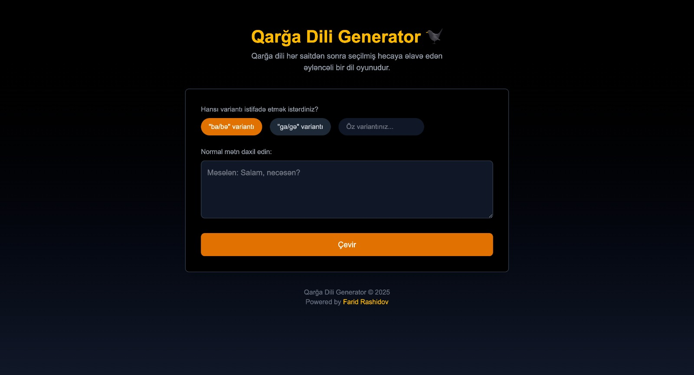

# Qarğa Dili Generator 🐦‍⬛

"Qarğa Dili" (Qarğa Dili) generator, ənənəvi Azərbaycan dil oyunu olan Qarğa Dilini normal mətndən avtomatik olaraq yaradan veb tətbiqdir.

## Qarğa Dili nədir?

Qarğa Dili, normal danışıq dilində hər sait hərfdən (a, e, i, o, u, ə) sonra "ba" və ya fərqli bölgələrdə "g", "ga" kimi hecalar əlavə olunmaqla yaradılan əyləncəli bir dil oyunudur.

Məsələn:

- "Salam" → "Sabalabam"
- "Necəsən?" → "Nebəcəbəsəban?"
- "Mən məktəbə gedirəm." → "Məbən məbəktəbəbə gebedirəbəm."

## Özəlliklər

- Normal mətni Qarğa Dilinə çevirmə
- Fərqli bölgə variantlarını dəstəkləmə (ba, ga və ya xüsusi əlavələr)
- Qaranlıq/işıqlı mövzu dəstəyi
- Mobil uyğun dizayn
- Nəticəni mübadilə buferinə kopyalama

## Ekran görüntüləri



## Texnologiyalar

- Next.js 15
- React 19
- Tailwind CSS 4
- TypeScript

## Necə İstifadə Olunur

1. Bir mətn daxil edin
2. Bölgə variantını seçin (ba, g, ga və ya xüsusi)
3. "Çevir" düyməsinə klikləyin
4. Nəticəni görüntüləyin və istəsəniz kopyalayın

## Quraşdırma və İşə Salma

```bash
# Layihəni klonlayın
git clone https://github.com/imrashidov/qarga-dili-generator.git
cd qarga-dili

# Asılılıqları yükləyin
npm install

# İnkişaf serverini başladın
npm run dev
```

Brauzerinizdə [http://localhost:3000](http://localhost:3000) ünvanını açaraq tətbiqi görüntüləyə bilərsiniz.

## Lisenziya

MIT
